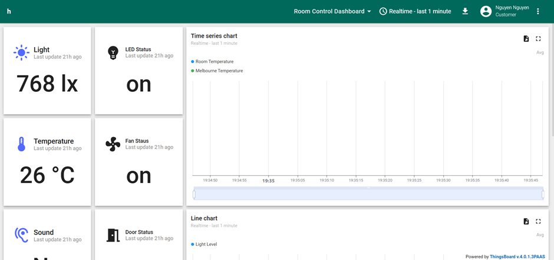
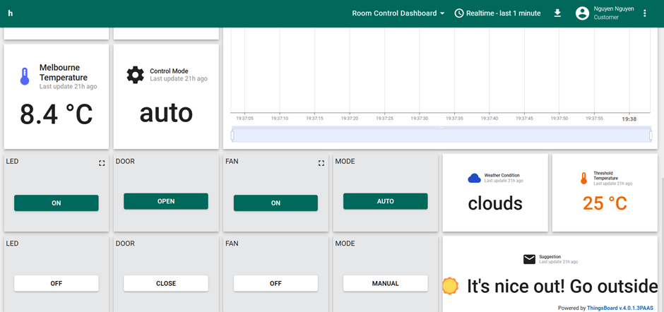
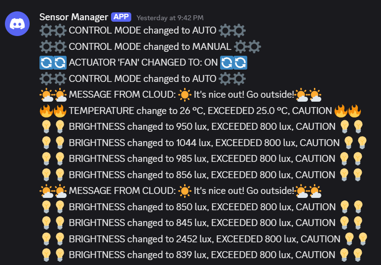
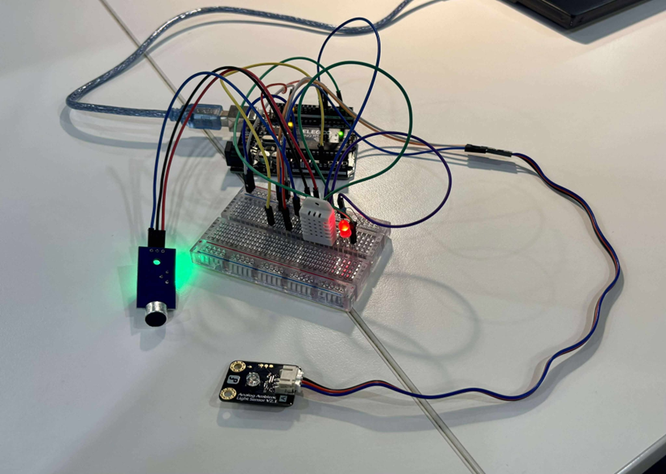
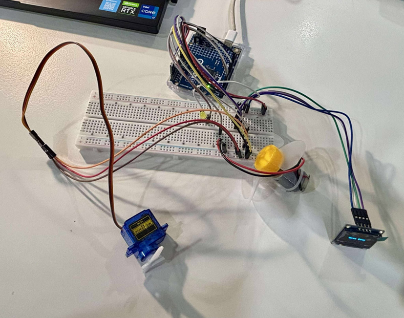

# Smart Room Environment Control

A comprehensive IoT solution for intelligent room environment monitoring and automated control, featuring sensor data collection, edge computing, cloud integration, and real-time notifications.


*Real-time monitoring dashboard showing sensor data and actuator controls*

## 🎥 Demo Video
**[Watch the Full System Demo](https://youtu.be/NK5KWFhnp8U)**

---

## 🏗️ System Architecture

The system follows a three-tier architecture:

```
┌─────────────────┐    ┌─────────────────┐    ┌─────────────────┐
│   EDGE LAYER    │    │   CLOUD LAYER   │    │   DASHBOARD     │
│                 │    │                 │    │                 │
│ Arduino Sensors │◄──►│ Edge Computing  │◄──►│ ThingsBoard     │
│ Arduino Control │    │ Local Database  │    │ Weather API     │
│                 │    │ MQTT Broker     │    │ Discord Alerts  │
└─────────────────┘    └─────────────────┘    └─────────────────┘
```

## 🔧 Hardware Components

### Indoor Unit (Inside Arduino)
- **Microcontroller**: Arduino Uno/Nano
- **Display**: OLED SSD1306 (128x64)
- **Actuators**:
  - LED (Pin 3) - Lighting control
  - Fan Motor (Pin 4) - Ventilation
  - Servo Motor (Pin 9) - Door/window automation
- **Libraries**: U8x8lib, Servo

### Outdoor Unit (Outside Arduino)
- **Microcontroller**: Arduino Uno/Nano
- **Sensors**:
  - DHT22 (Pin 7) - Temperature and humidity
  - Photoresistor (Pin A0) - Light intensity
  - Sound sensor (Pin 6) - Noise detection
- **Indicator**: Message LED (Pin 2)
- **Libraries**: DHT

## 📦 Software Dependencies

### Python Requirements
```bash
pip install serial pymysql paho-mqtt requests schedule
```

### Arduino Libraries
- U8x8lib (OLED display)
- Servo (servo motor control)
- DHT (temperature/humidity sensor)

## 🚀 Installation & Setup

### 1. Hardware Setup
1. Connect sensors and actuators according to pin definitions in the Arduino code
2. Upload `Inside_Arduino.ino` to the indoor Arduino
3. Upload `Outside_Arduino.ino` to the outdoor Arduino
4. Connect both Arduinos to the edge computing device via USB

### 2. Database Setup
```sql
-- Create databases
CREATE DATABASE sensorslog;
CREATE DATABASE actuatorslog;

-- Tables are created automatically by the Python scripts
```

### 3. Configuration
Update configuration variables in the Python files:

#### MQTT Broker
```python
MQTT_BROKER = "your_mqtt_broker_ip"  # Update in all Python files
```

#### Discord Webhook (Optional)
```python
DISCORD_WEBHOOK_URL = "your_discord_webhook_url"
```

#### Weather API
```python
OPENWEATHER_API_KEY = "your_openweather_api_key"
LOCATION = "your_city,country_code"
```

#### ThingsBoard
```python
THINGSBOARD_TOKEN = "your_device_token"
```

### 4. Run the System
```bash
# Terminal 1 - Outside edge processing
python outside_edge.py

# Terminal 2 - Inside edge processing  
python inside_edge.py

# Terminal 3 - Cloud server
python cloud_server.py
```

## 🎯 Features

### Automated Environmental Control
- **Smart Lighting**: LED turns on automatically when ambient light is low
- **Ventilation Control**: Fan activates when temperature exceeds threshold
- **Access Control**: Door/window opens based on environmental conditions
- **Noise Monitoring**: System responds to sound levels for security

### Operating Modes
- **Automatic Mode**: System responds to sensor inputs automatically
- **Manual Mode**: Remote control via ThingsBoard dashboard
- **Threshold Adjustment**: Dynamic temperature thresholds based on weather

### Data Management
- **Real-time Logging**: Sensor and actuator data stored in MySQL
- **MQTT Communication**: Efficient data transmission between components
- **Daily Reports**: Automated report generation and Discord notifications

### Cloud Integration
- **Weather Integration**: OpenWeatherMap API for weather-based decisions
- **ThingsBoard Dashboard**: Real-time monitoring and control
- **Discord Notifications**: Instant alerts for system events

## 📸 Screenshots

### ThingsBoard Dashboard

*Real-time sensor monitoring and actuator control interface*

### Discord Notifications

*Automated alerts and daily reports*

### Hardware Outside Setup

### Hardware Inside Setup

*Arduino sensors and actuators in operation*

---

### Edge Layer Topics
```
edge/outside/data     # Sensor data from outdoor unit
edge/outside/status   # Acknowledgment messages
edge/inside/data      # Actuator status from indoor unit
```

### Cloud Layer Topics
```
cloud/control/mode    # System mode control
cloud/control/led     # LED control
cloud/control/fan     # Fan control  
cloud/control/door    # Door control
cloud/suggestion      # Weather-based suggestions
```

### ThingsBoard Topics
```
v1/devices/me/telemetry        # Data publishing
v1/devices/me/rpc/request/+    # Remote control commands
```

## 🎮 Usage

### ThingsBoard Dashboard
1. Access your ThingsBoard instance
2. Monitor real-time sensor data
3. Control actuators remotely
4. View historical data and analytics

### Discord Notifications
- Receive alerts for threshold breaches
- Get daily reports
- Monitor system mode changes
- Track actuator state changes

### Local Database Queries
```sql
-- View recent sensor data
SELECT * FROM sensorslog.logs ORDER BY time DESC LIMIT 10;

-- View actuator activity
SELECT * FROM actuatorslog.logs ORDER BY time DESC LIMIT 10;
```

## 🔍 Troubleshooting

### Common Issues

**Arduino Not Detected**
```bash
# Check USB connection
ls /dev/ttyACM*
ls /dev/ttyUSB*

# Update serial port in Python files
arduino = serial.Serial('/dev/ttyACM0', 9600, timeout=1)
```

**MQTT Connection Failed**
- Verify broker IP address and port
- Check network connectivity
- Ensure MQTT broker is running

**Database Connection Error**
- Verify MySQL credentials
- Check if databases exist
- Ensure MySQL service is running

**Weather API Issues**
- Verify API key is valid
- Check location format
- Monitor API rate limits

### Debug Mode
Enable debug output by adding print statements or using Python logging:
```python
import logging
logging.basicConfig(level=logging.DEBUG)
```

## 📈 System Metrics

### Performance Specifications
- **Update Interval**: 3 seconds for sensor readings
- **MQTT Publishing**: 10 seconds for telemetry
- **Database Logging**: Real-time for all events
- **Weather Updates**: 2 minutes interval
- **Report Generation**: Daily at 23:59

### Sensor Specifications
- **Temperature Range**: -40°C to 80°C (DHT22)
- **Light Range**: 0-6000 lux (calculated)
- **Sound Detection**: Digital threshold-based
- **Servo Range**: 0° to 90° (door control)